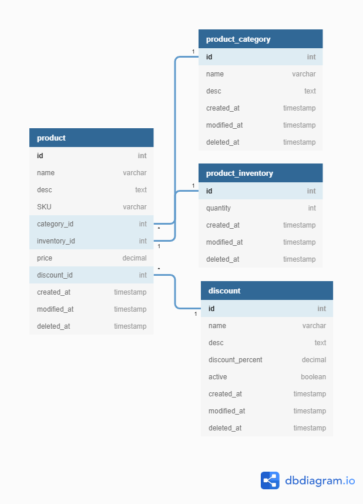

### Q. Explain the relationship between the "Product" and "Product_Category" entities from the above diagram.

The relationship between the "Product" and "Product_Category" is **many-to-one** relationship.

Here's what that means:

- **One Category, Many Products:** A single category can have many products associated with it. For example, a "Furniture" category might have products like doors, windows, sofas, etc.
- **One Product, One Category:** A product belongs to only one category.

The `category_id` column in the product table acts as a **foreign key**. It references the primary key `id` of the **product_category** table.

---

### Q. How could you ensure that each product in the "Product" table has a valid category assigned to it?

There are several ways to ensure each product in the "Product" table has a valid category assigned to it:

1. We can set up a foreign key constraint on the `category_id` column in the "Product" table. This constraint references the primary key `id` of the "Product Category" table. The database will then enforce data integrity, preventing products from being inserted with a non-existent `category_id`.

2. We can implement validation logic within our application (like in Express.js).This logic would check if the provided `category_id` exists in the "Product Category" table before inserting or updating a product record.

---

### 3. Create schema in any Database script or any ORM (Object Relational Mapping).

Schema of all tables with database connection is in **[schema.js](schema.js)**
Here I have used Sequelize ORM which works in Node.js
